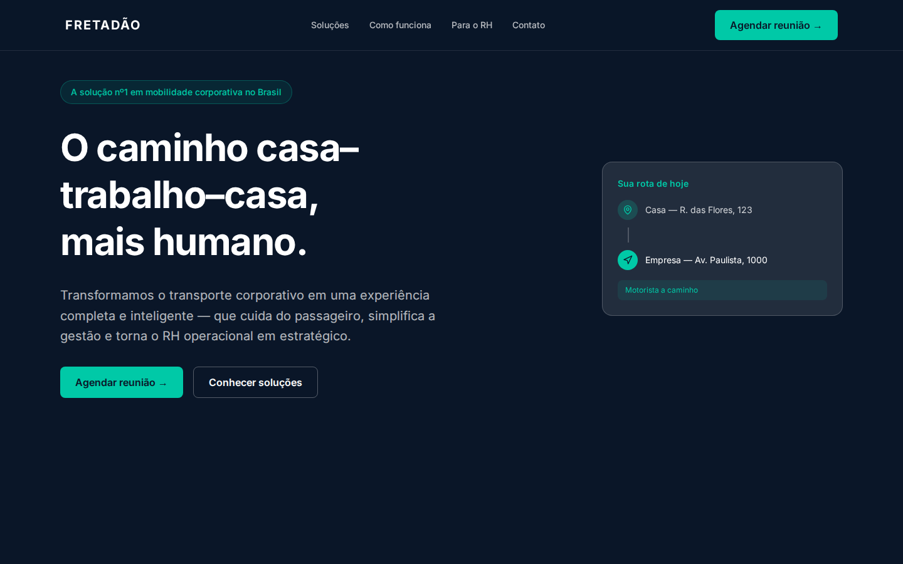
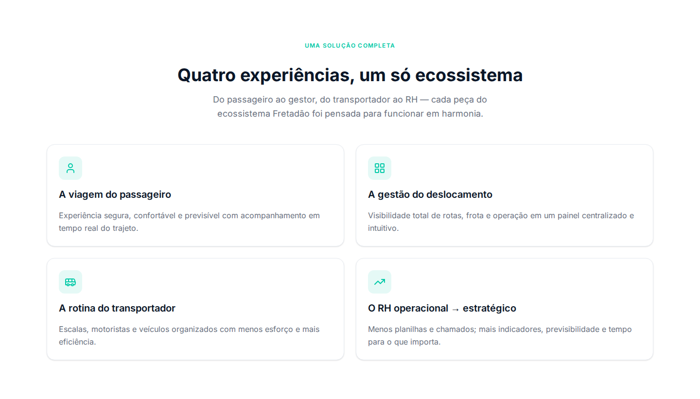
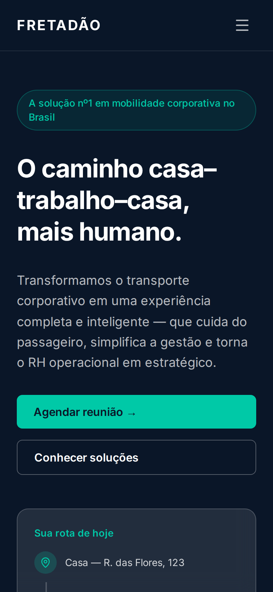
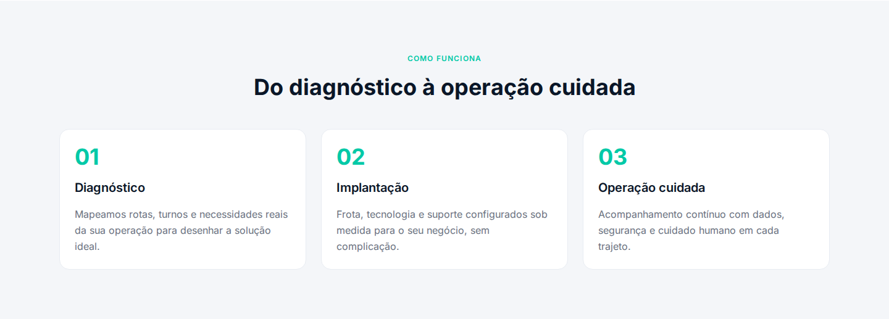
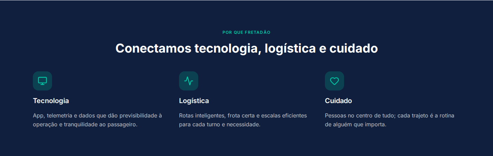
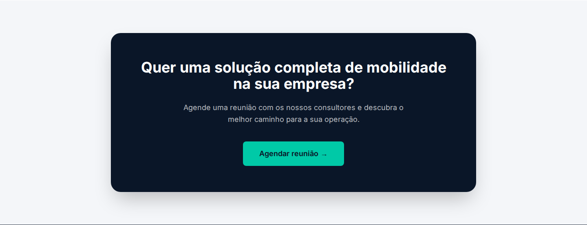
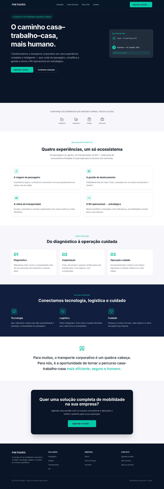
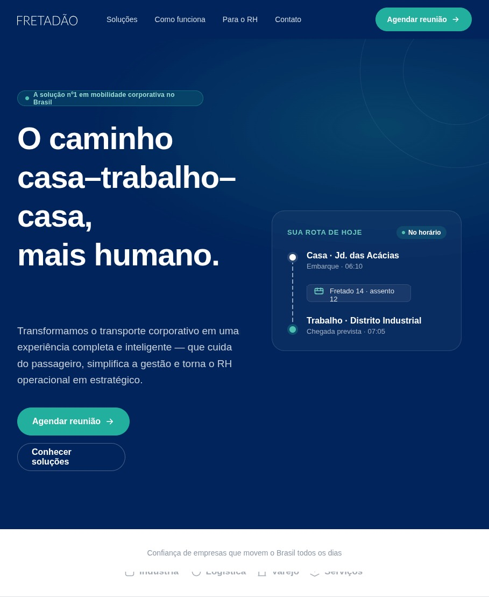

# Spec-Driven Development: Fretadão Site

This repository was built for an **internal Fretadão Tech Talk** on **Spec-Driven Development (SDD)**. It walks through a real, complete example: starting from an approved design and ending with a tested application, with specifications guiding the AI-assisted work in Claude Code.

The site itself, **`fretadao-site/`**, is the hands-on example for the talk. It's a Fretadão institutional homepage built end to end through the PRD → Tech Spec → Tasks → Implementation → Review → QA flow. Every step left a versioned artifact in [`tasks/prd-site-fretadao/`](tasks/prd-site-fretadao/), so you can follow how each document fed into the next.

## Why Spec-Driven Development

SDD doesn't start by asking the AI for code. You first write down **what** needs to be built (PRD) and **how** (Tech Spec), then split the work into small tasks that can each be verified. What you get out of it:

- **Explicit context:** the AI works from documents that people have reviewed, not from a one-off prompt.
- **Traceability:** every PRD requirement shows up in the Tech Spec, the tasks, the tests and the QA report.
- **Approval checkpoints:** each phase stops and waits for sign-off before moving on.
- **Verifiable quality:** every task ships with tests, and review and QA close the loop with evidence.

> This is not Fretadão's official website. It's teaching material, and its content and design only illustrate the process.

## The `fretadao-site`

A one-page corporate mobility landing page aimed at HR teams and company managers. It presents Fretadão's value proposition and the four solutions in its ecosystem (Passenger, Management, Transport Operator and HR), and it leads visitors to the main CTA, **"Agendar reunião"** ("Book a meeting"). The site is fully static, with no backend, login or forms. Its content is in Brazilian Portuguese.



### Screens

<table>
  <tr>
    <td width="70%"></td>
    <td width="30%" rowspan="2"></td>
  </tr>
  <tr>
    <td></td>
  </tr>
  <tr>
    <td></td>
    <td></td>
  </tr>
</table>

<details>
<summary>Full page (desktop)</summary>



</details>

### From design to code

The talk starts from the approved design in [`site/`](site/). Putting the design next to the implementation shows what the specs kept (structure, copy and CTAs) and where things were adapted (color palette and details of the route card):

| Approved design | Implementation |
|-----------------|----------------|
|  |  |

The screenshots live in `docs/screenshots/` and were captured with Playwright, at 1440×900 for desktop and 390×844 for mobile.

**Status:** all three tasks are done and QA passed. All 28 PRD requirements were met and all 48 E2E tests passed. See [`qa-report.md`](tasks/prd-site-fretadao/qa-report.md).

### Page sections

`src/App.tsx` renders the sections in this order:

1. `Header`: logo, anchor navigation (Soluções, Como funciona, Para o RH, Contato) and the CTA
2. `HeroSection`: headline, CTAs and the "Sua rota de hoje" ("Your route today") widget
3. `SocialProofSection`: industries served (Indústria, Logística, Varejo, Serviços)
4. `SolutionsSection`: the four experiences in the ecosystem
5. `HowItWorksSection`: Diagnosis, Rollout and Operations
6. `WhyFretadaoSection`: Technology, Logistics and Care
7. `ManifestoSection`: highlighted quote
8. `CtaSection`: final call to book a meeting
9. `Footer`

### Stack

| Layer | Technology |
|-------|------------|
| Build / dev server | Vite 8 |
| UI | React 19 + TypeScript 6 (`strict`) |
| Styling | Tailwind CSS 4 + design tokens in `src/theme/` |
| Icons | `lucide-react` |
| Unit tests | Vitest 4 + React Testing Library (jsdom) |
| E2E tests | Playwright (Chromium) |
| Linting | ESLint 10 + typescript-eslint |

### Running locally

```bash
cd fretadao-site
npm install
echo "VITE_BOOKING_URL=https://your-booking-link" > .env.local
npm run dev            # http://localhost:5173
```

| Variable | Description |
|----------|-------------|
| `VITE_BOOKING_URL` | URL of the scheduling tool used by every "Agendar reunião" button. If it's not set, the buttons fall back to `#contato`. |

### Scripts

| Command | What it does |
|---------|--------------|
| `npm run dev` | Starts the dev server |
| `npm run build` | Type-checks (`tsc -b`) and builds static files into `dist/` |
| `npm run preview` | Serves the production build |
| `npm run lint` | Runs ESLint |
| `npm test` | Runs unit tests (Vitest) |
| `npm run test:e2e` | Runs the E2E tests in `e2e/` and starts `vite` automatically |

Before running E2E tests for the first time, install the browser with `npx playwright install chromium`.

### Structure

```
fretadao-site/
  e2e/                     # homepage.spec.ts, qa-full.spec.ts
  public/                  # favicon and icon sprites
  src/
    theme/                 # color, typography and spacing tokens
    constants/             # strings, navigation and env (bookingUrl)
    types/                 # content types
    components/
      ui/                  # primitives: Button, Card, SectionLabel, RouteWidget
      layout/              # Header, Footer
      sections/            # one page section per file
    App.tsx                # composes the sections
```

Imports use the `@/` → `src/` alias.

## Repository structure

```
.claude/
  agents/      # task-reviewer: reviews each finished task
  commands/    # SDD flow commands
  rules/       # standards: git, testing, security, frontend, debug, TypeScript
site/          # approved design (reference screenshots for each section)
templates/     # PRD, Tech Spec, tasks and task templates
tasks/         # artifacts generated by the flow (PRD, Tech Spec, tasks, reviews, QA)
  prd-site-fretadao/
    prd.md, techspec.md, tasks.md, N_task.md
    N_task_review.md, review-report.md, qa-report.md
fretadao-site/ # the application
```

## Development flow (SDD)

The commands live in `.claude/commands/` and are run in Claude Code in this order. Their names and prompts are in English:

1. **`/create-prd`**: turns the design in `site/` into requirements and writes `prd.md`
2. **`/create-techspec`**: makes the technical and architecture decisions and writes `techspec.md`
3. **`/create-tasks`**: splits the work into incremental tasks, each with its own tests, and writes `tasks.md` and `N_task.md`
4. **`/run-task`**: implements one task, then the `task-reviewer` agent writes `N_task_review.md`
5. **`/run-review`**: reviews all the code and writes `review-report.md`
6. **`/run-qa`**: checks the site with Playwright, against WCAG 2.2 and visually, then writes `qa-report.md`
7. **`/run-bugfix`**: fixes everything listed in `bugs.md` and adds regression tests

## Conventions

The full rules are in `.claude/rules/`. In short:

- **Theme before components:** no inline styles, colors or fonts, and all copy lives in `constants/strings.ts`
- **TypeScript:** `strict: true`, no `any`
- **Tests:** names follow `should <behavior> when <condition>`, use Arrange-Act-Assert, and React Testing Library checks what the user actually sees
- **Git:** Conventional Commits, with branches named `feature/…`, `fix/…` and `chore/…`
